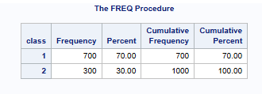
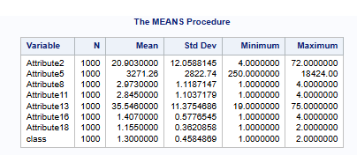
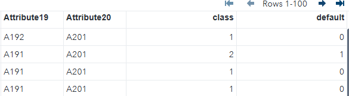
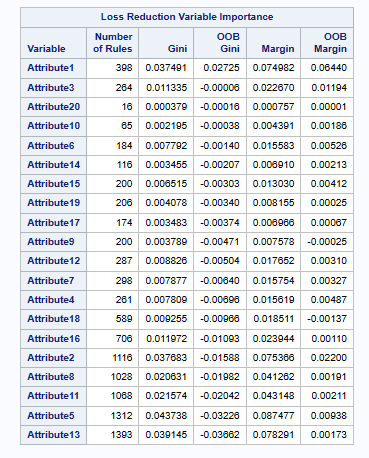
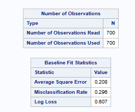
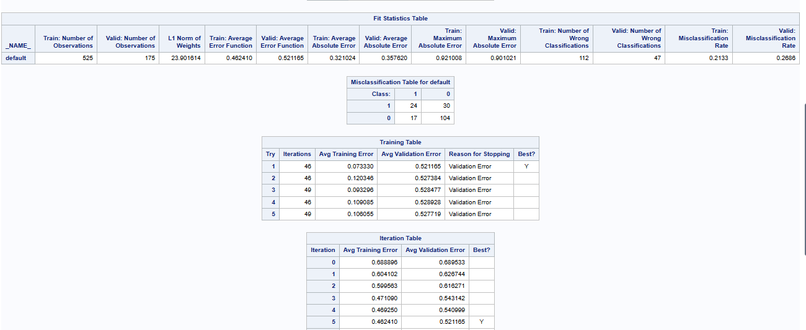
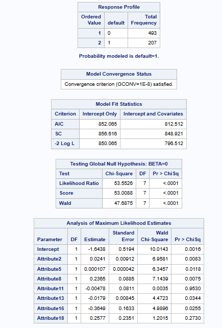
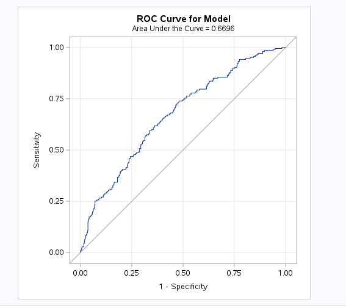

# Credit Risk Analysis in SAS

This project demonstrates credit risk modeling using SAS Studio. The full coding script is available [here](https://github.com/chenny-l/credit_data/blob/main/credit_risk.sas). 

We worked with a multivariate dataset containing 1000 customers, 20 features, and a binary target variable:

class = 1 → good customer

class = 2 → bad customer

The dataset contains 70% good customers and 30% bad customers.

 

## Feature Overview 

The data was sourced from [UCI Machine Learning Repository](https://archive.ics.uci.edu/dataset/144/statlog+german+credit+data).

| #  | Attribute                           | Type        | Description / Possible Values                                                                                                                                                                                                                                            |
| -- | ----------------------------------- | ----------- | ------------------------------------------------------------------------------------------------------------------------------------------------------------------------------------------------------------------------------------------------------------------------ |
| Attribute 1  | Status of existing checking account | Qualitative | A11: < 0 DM   A12: 0 ≤ … < 200 DM   A13: ≥ 200 DM / salary assigned ≥ 1 year   A14: No checking account                                                                                                                                                         |
| Attribute 2  | Duration                            | Numerical   | Duration in months                                                                                                                                                                                                                                                       |
| Attribute 3  | Credit history                      | Qualitative | A30: No credits taken / all credits paid back duly   A31: All credits at this bank paid back duly   A32: Existing credits paid back duly till now   A33: Delay in paying off in the past   A34: Critical account / other credits existing (not at this bank) |
| Attribute 4  | Purpose                             | Qualitative | A40: Car (new)   A41: Car (used)   A42: Furniture/equipment   A43: Radio/television   A44: Domestic appliances   A45: Repairs   A46: Education   A47: Vacation (?)   A48: Retraining   A49: Business   A410: Others                        |
| Attribute 5  | Credit amount                       | Numerical   | Credit amount in DM                                                                                                                                                                                                                                                      |
| Attribute 6  | Savings account / bonds             | Qualitative | A61: < 100 DM   A62: 100 ≤ … < 500 DM   A63: 500 ≤ … < 1000 DM   A64: ≥ 1000 DM   A65: Unknown / no savings account                                                                                                                                          |
| Attribute 7  | Present employment since            | Qualitative | A71: Unemployed   A72: < 1 year   A73: 1 ≤ … < 4 years   A74: 4 ≤ … < 7 years   A75: ≥ 7 years                                                                                                                                                               |
| Attribute 8  | Installment rate                    | Numerical   | Installment rate as % of disposable income                                                                                                                                                                                                                               |
| Attribute 9  | Personal status and sex             | Qualitative | A91: Male, divorced/separated   A92: Female, divorced/separated/married   A93: Male, single   A94: Male, married/widowed   A95: Female, single                                                                                                               |
| Attribute 10 | Other debtors / guarantors          | Qualitative | A101: None   A102: Co-applicant   A103: Guarantor                                                                                                                                                                                                                  |
| Attribute 11 | Present residence since             | Numerical   | Number of years at current residence                                                                                                                                                                                                                                     |
| Attribute 12 | Property                            | Qualitative | A121: Real estate   A122: Building society savings / life insurance   A123: Car / other (not in attribute 6)   A124: Unknown / no property                                                                                                                      |
| Attribute 13 | Age                                 | Numerical   | Age in years                                                                                                                                                                                                                                                             |
| Attribute 14 | Other installment plans             | Qualitative | A141: Bank   A142: Stores   A143: None                                                                                                                                                                                                                             |
| Attribute 15 | Housing                             | Qualitative | A151: Rent   A152: Own   A153: For free                                                                                                                                                                                                                            |
| Attribute 16 | Number of existing credits          | Numerical   | Number of credits at this bank                                                                                                                                                                                                                                           |
| Attribute 17 | Job                                 | Qualitative | A171: Unemployed / unskilled – non-resident   A172: Unskilled – resident   A173: Skilled employee / official   A174: Management / self-employed / highly qualified employee / officer                                                                           |
| Attribute 18 | People liable for maintenance       | Numerical   | Number of people dependent on applicant                                                                                                                                                                                                                                  |
| Attribute 19 | Telephone                           | Qualitative | A191: None   A192: Yes, registered under customer’s name                                                                                                                                                                                                              |
| Attribute 20 | Foreign worker                      | Qualitative | A201: Yes   A202: No                                                                                                                                                                                                                                                  |
## Data Preparation

- The original dataset was cleaned using Python and converted from `.DAT` to `.CSV`.
- The `CSV` file was uploaded into SAS Studio for analysis.
- Initial exploration included checking for missing values, calculating descriptive statistics (mean, standard deviation), and understanding distributions.

  
  
- The target variable was set up as default, and categorical variables were encoded for modeling.

## Modelling Approach

We fitted several models to predict credit risk:

1. Logistic Regression, serving as a baseline.
2. Random Forest. We assessed non-linear interactions and variable importance.
3. Neural Network. It captured complex patterns and non-linear relationships.

## Feature Importance Highlights 
Based on the Gini score from the Random Forest model, the most predictive features are:

Attribute 5: `Credit amount`

Attribute 13: `Age`

Attribute 2: `Duration of credit`

Attribute 1: `Status of existing checking account`

Attribute 8: `Installment rate`

This shows the **business intuition**: larger loans, customer age, existing account status, and repayment capacity are key indicators of creditworthiness.

## Model Performance

**Neural Network:**

- True negative rate (good customers) ~ 59.42%
- False negative rate (bad customers predicted as good) ~ 9.7%

**Logistic Regression:** 

- Area Under the ROC Curve (AUC) = 0.6696
- Provides a solid baseline for binary classification.

## Business Implications

- Credit amount, age, duration, and account status are actionable variables for underwriting policies.
- Model comparison: Neural networks capture more subtle patterns, while logistic regression provides interpretability for regulatory compliance.

Next Steps:
- Expand the dataset for robustness and generalization.
- Fine-tune models (hyperparameters, deeper networks) to improve predictive performance.
- Integrate model outputs into a decision-support tool (SaaS) for credit analysts.

